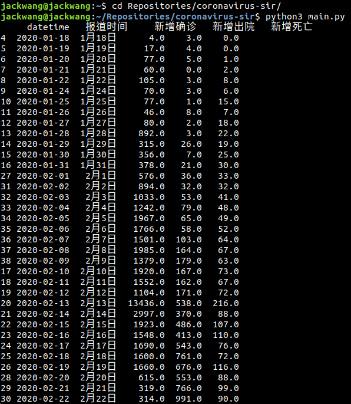
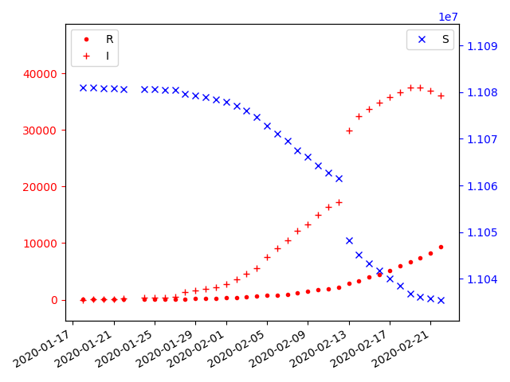
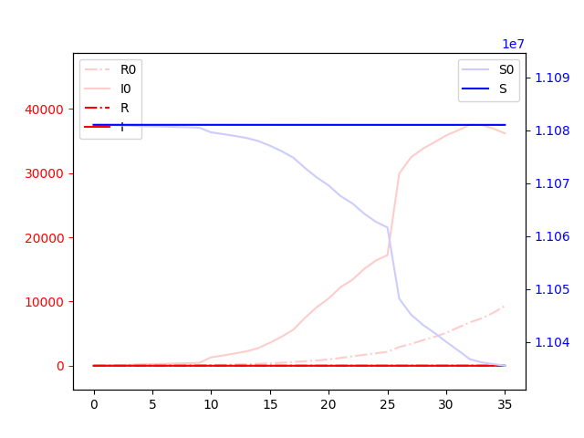
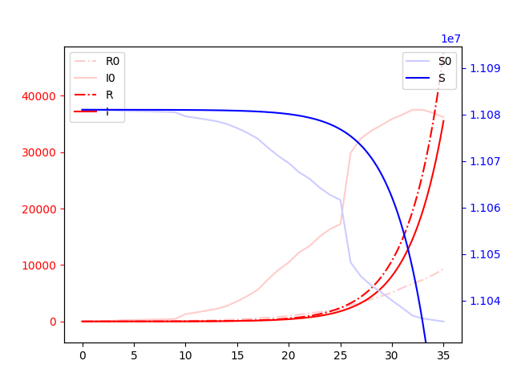
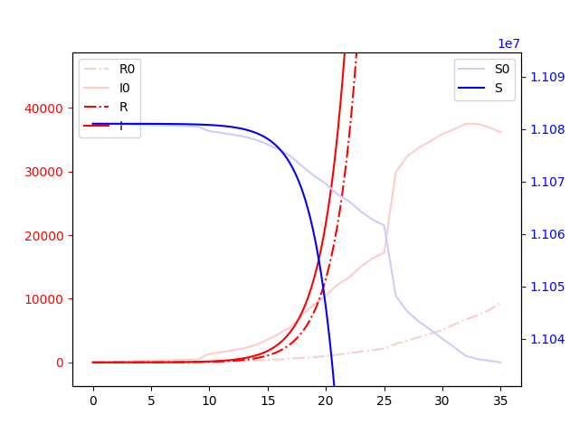
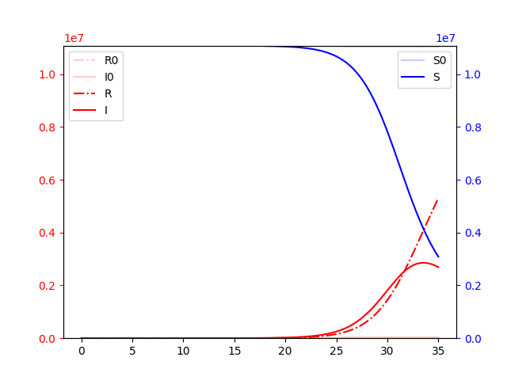

# coronavirus-sir
Small project for using coronavirus epidemic data and SIR model to simluate.

## SIR model

Wiki:
[https://en.wikipedia.org/wiki/Compartmental_models_in_epidemiology](https://en.wikipedia.org/wiki/Compartmental_models_in_epidemiology)

## Dataset

疫情数据由澎湃新闻美数课整理提供:
[https://github.com/839Studio/Novel-Coronavirus-Updates](https://github.com/839Studio/Novel-Coronavirus-Updates)

## Results

The infected numbers start to drop until mosts of population are infected.

